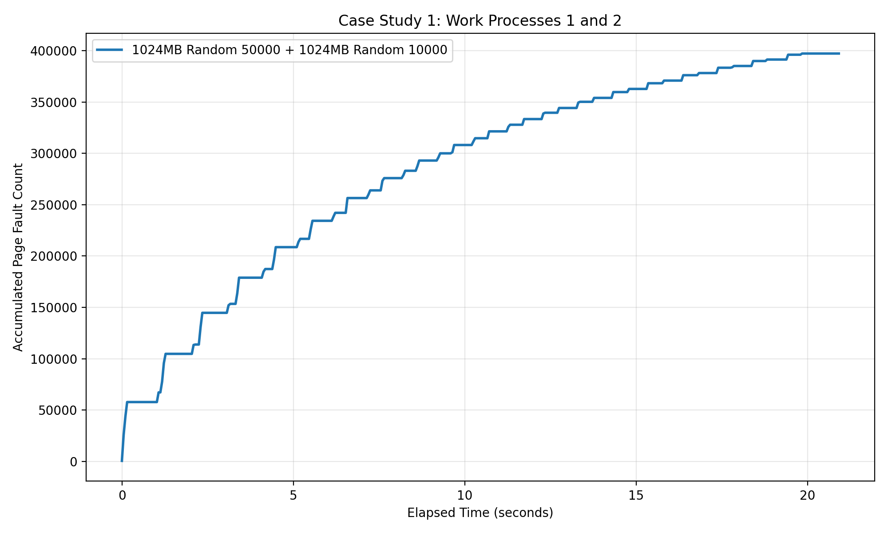
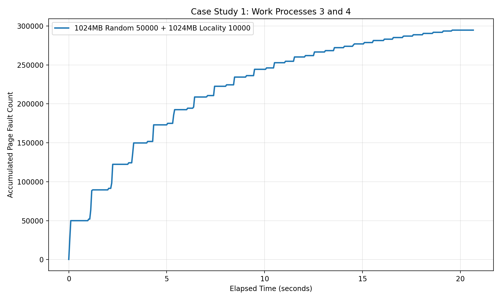
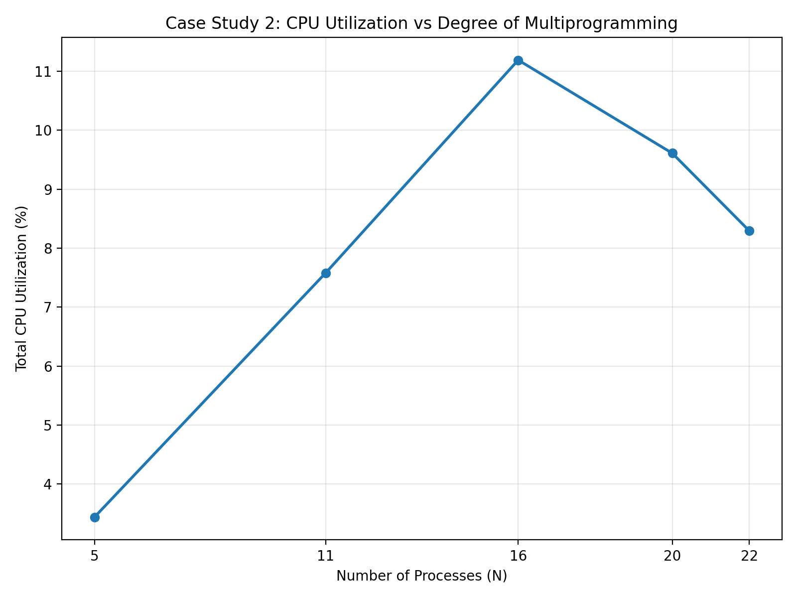

# CS423 MP3 — Memory and CPU Utilization Monitoring

This project implements a Linux kernel module that monitors CPU usage and page fault statistics for registered processes. The module periodically samples system information and exposes the collected data to user space through a memory mapped buffer. The collected data is then used to perform the required case studies.

# Case Study 1

For case study 1, two different sets of workloads were run to observe how memory access patterns affect page faults over time. In both runs, each process allocated 1024MB of memory and the kernel module sampled page faults every 50ms.

## Work Processes 1 and 2

- Work 1: 1024MB Random, 50000 accesses  
- Work 2: 1024MB Random, 10000 accesses  

The accumulated page faults over time are shown below:

In this run, both processes used random access patterns. Because of this, the working set was spread across memory and pages were less likely to be reused before being evicted. This caused a steady increase in page faults throughout execution. The total accumulated page faults reached roughly 397,000 by the end of the run.

The workload with 50000 accesses also ran longer and contributed more to the total page faults, which is why the curve continues increasing for a longer period of time. The total runtime of this experiment was about 20.9 seconds.

---

## Work Processes 3 and 4

- Work 3: 1024MB Random, 50000 accesses  
- Work 4: 1024MB Locality, 10000 accesses  

The accumulated page faults over time are shown below:

In this run, the second process used locality based memory access instead of random access. Because of this, memory accesses were more concentrated instead of being spread uniformly across the full allocation, which reduced the number of page faults. The accumulated page faults increased more slowly and reached roughly 295,000 total faults.

This run also completed slightly faster, with a total runtime of about 20.7 seconds.

---

## Comparison

Comparing the two runs, the random + random workload produced significantly more page faults than the random + locality workload. The total accumulated page fault count dropped from about 397,000 to about 295,000, which is a reduction of roughly 102,000 faults, or about 26%.

This difference is expected because locality improves reuse of nearby memory instead of constantly touching unrelated pages across the entire address space. As a result, fewer new pages must be brought in and fewer page faults occur over time.

The completion time difference between the two runs is smaller than the page fault difference. This is because the heavier 50000 access random workload is present in both experiments and dominates much of the total runtime. Even so, the locality based version still finishes a little sooner and produces a clearly lower accumulated page fault curve.

This case study shows that memory access patterns have a direct impact on page fault behavior, and that locality based access patterns result in fewer page faults compared to random access.

## Case Study 2

For Case Study 2, the goal was to evaluate how CPU utilization changes as the degree of multiprogramming increases. In this case, multiple identical workloads were executed simultaneously, and the total CPU utilization of all processes was measured.

Each workload used:
- 200MB memory footprint  
- Random locality access pattern  
- 10,000 accesses per iteration  

The experiment was repeated with the following number of processes:

N = 5, 11, 16, 20, 22

For each run:
1. The MP3 module was loaded  
2. N instances of the workload were launched simultaneously  
3. The monitor program collected profiling data  
4. The resulting `.data` file was processed in a Jupyter notebook  
5. Total CPU utilization was computed and plotted  

The resulting graph is shown below:

### Observations

From the graph, CPU utilization increases as the number of processes increases from 5 to 16:

- N = 5 → ~3.4% utilization  
- N = 11 → ~7.6% utilization  
- N = 16 → ~11.2% utilization  

This behavior is expected, since adding more processes allows the CPU to perform useful work while other processes are waiting on memory operations. Increasing multiprogramming initially improves CPU utilization.

However, after N = 16, utilization begins to decrease:

- N = 20 → ~9.6% utilization  
- N = 22 → ~8.3% utilization  

At these higher process counts, the system becomes memory bound. Too many processes compete for memory at the same time, leading to substantially more page faults and much heavier memory contention. As a result, the CPU spends more time stalled by the memory system and less time doing useful work, which reduces overall CPU utilization.

### Completion Time Behavior

In addition to utilization, runtime also increased significantly for larger N values. The approximate runtimes were:

- N = 5 → ~20.2 seconds  
- N = 11 → ~20.4 seconds  
- N = 16 → ~20.5 seconds  
- N = 20 → ~50.8 seconds  
- N = 22 → ~280.1 seconds  

This shows that performance remains relatively stable up to N = 16, but degrades sharply after that point. The large jump in runtime at N = 20 and especially N = 22 indicates that the system is under heavy memory pressure.

A major reason for this is the increase in hard page faults once the degree of multiprogramming becomes too large. In the lower N runs, hard faults were essentially absent, but at N = 20 and N = 22 they became significant. This indicates that the system was relying much more heavily on swap activity, which is much slower than normal memory access.

### Conclusion

This experiment demonstrates that increasing the degree of multiprogramming improves CPU utilization only up to a certain point. In this case, utilization peaked around **N = 16**. Beyond this point, adding more processes caused increased memory contention, more severe page fault behavior, and much longer completion times.

This behavior is consistent with expected operating system behavior, where excessive multiprogramming eventually leads to diminishing returns and then reduced performance due to memory bottlenecks and thrashing.

# MP3 Implementation Overview

## Overview

This MP3 implements a Linux kernel module that monitors CPU usage and page fault statistics for a set of registered processes. The module periodically samples system statistics and stores them in a kernel buffer, which is then exposed to user space through a memory mapped character device. A user space monitor program reads this mapped buffer and writes the collected data to a file for analysis.

The implementation consists of three main components:

- /proc/mp3/status interface for registering/unregistering processes  
- Periodic kernel sampling using delayed work  
- Memory mapped buffer exposed through a character device  

---

# Kernel Module Design

## Process Registration

The module creates a `/proc/mp3/status` file that allows user-space programs to:

Register a process:
R <pid>

Unregister a process:
U <pid>

Reading `/proc/mp3/status` returns the list of currently registered PIDs.

Registered processes are stored in a kernel linked list.

Each entry stores:
- PID
- Linked list pointers

A mutex (mp3_lock) protects the list to ensure safe concurrent access.

When the first process is registered:
- Sampling begins

When the last process is removed:
- Sampling stops

This prevents unnecessary CPU overhead.

If a process exits while still registered, it is removed from the list during sampling when the kernel can no longer retrieve statistics for it.

---

# Periodic Sampling

Sampling is performed using delayed work.

Sampling interval:
50 ms (20 samples per second)

At each interval:

1. Iterate through registered processes  
2. Call get_cpu_use()  
3. Collect:
   - Minor page faults
   - Major page faults
   - User CPU time
   - System CPU time
4. Sum values across all processes  
5. Store into kernel buffer  

Each sample stores:

- jiffies timestamp
- total minor faults
- total major faults
- total CPU time

Only one aggregated sample is written per sampling interval. This sample represents the total activity of all currently registered processes during that 50 ms window.

---

# Kernel Buffer

The kernel buffer is allocated using vmalloc.

Buffer size:
128 pages

The buffer is initialized to -1 when the module is loaded.

The buffer is treated as a circular buffer:

- Each sample uses 4 unsigned long values
- sample_index increments each sample
- Wraps when max size reached

Pages are marked reserved so they can be memory mapped to user space.

---

# Character Device and mmap

Character device:

Major: 423  
Minor: 0

Device node creation:

mknod node c 423 0

The monitor program:

- Opens device
- Uses mmap()
- Reads buffer directly

mp3_mmap():

- Converts vmalloc pages to page frame numbers
- Uses remap_pfn_range()
- Maps kernel memory to user space one page at a time

This avoids expensive copy operations between kernel space and user space.

The open and release handlers are implemented as empty functions, while mmap provides the actual shared buffer interface required by the monitor.

---

# User Space Monitor

The monitor program:

1. Opens device
2. Memory maps buffer
3. Reads samples
4. Writes to .data file

Output format:

jiffies minor_faults major_faults cpu_time

This data is used for graphing and analysis.

---

# Synchronization

Synchronization mechanisms:

Mutex:
- Protect process list
- Protect sampling and list updates while the work function is iterating

Delayed work:
- Runs in process context
- Allows safe kernel work outside of interrupt context

---

# Module Lifecycle

## Initialization

mp3_init():

- Create /proc/mp3
- Create /proc/mp3/status
- Allocate and initialize buffer
- Mark buffer pages reserved
- Register char device
- Initialize delayed work

## Cleanup

mp3_exit():

- Cancel delayed work
- Remove remaining registered processes
- Remove proc entries
- Free buffer
- Clear reserved page flags
- Remove char device

---

# Summary

This MP3 implements:

- Process registration through /proc
- Periodic sampling
- Circular kernel buffer
- mmap user access
- Data collection for case studies

This design allows efficient monitoring of CPU usage and page faults for multiple processes and supports the experiments required in the assignment.